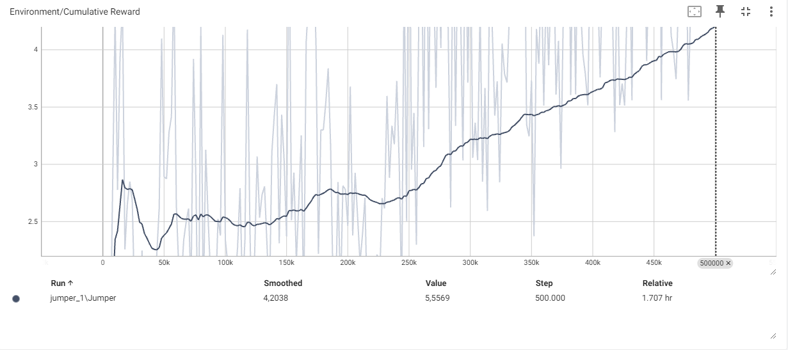

# ML Part3 Jumper Assignment

## Process

Ik begon met het creëren van een arena met 5 game objecten: het platform, de weg, de speler en een spawner object. Het platform vormt de basis van de arena waarop de speler zich bevindt. De speler, een kubus, wordt aangestuurd door de AI. Het spawner object is het startpunt van waaruit obstakels met verschillende snelheden en intervallen zullen verschijnen.

Om het spawner object volledig te maken, heb ik ook een apart game object voor obstakels gemaakt. Dit object heeft een trigger hitbox achter de balk, waardoor de speler een beloning ontvangt als hij veilig aan de overkant landt.

## Uitwerking

Na dat de basis arena klaar was kwam er een probleem waarbij de AI constant begon te springen om de balk te ontwijken, werd er een beloning van -1 toegevoegd aan het totaal elke keer dat de AI sprong. Om te voorkomen dat de speler constant in de lucht kon springen, werd er een raycast uitgevoerd om te controleren of de speler zich op de grond bevond (grounded).


## Configuratie

De volgende configuratie gebruik ik:

```yml
behaviors:
  Jumper:
    trainer_type: ppo
    hyperparameters:
      batch_size: 10
      buffer_size: 100
      learning_rate: 3.0e-4
      beta: 5.0e-4
      epsilon: 0.2
      lambd: 0.99
      num_epoch: 3
      learning_rate_schedule: linear
      beta_schedule: constant
      epsilon_schedule: linear
    network_settings:
      normalize: false
      hidden_units: 128
      num_layers: 2
    reward_signals:
      extrinsic:
        gamma: 0.99
        strength: 1
    max_steps: 500000
    time_horizon: 64
    summary_freq: 2000
```

## Resultaten

Uiteindelijk na 240000 stappen worden episode lengtes langer en langer tot er uiteindelijk minder en minder fouten worden gemaakt.



